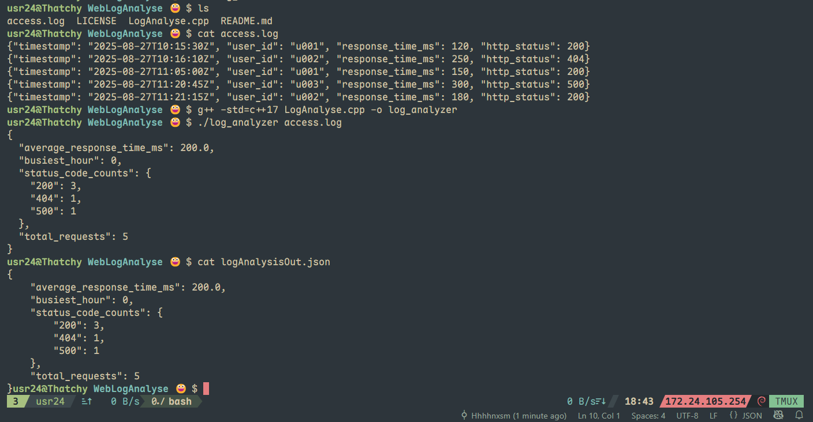

# 1. 如何运行

## 安装&使用

若Linux环境无C/C++, 首先安装`gcc/g++`编译器; 例如Debian环境
```bash
sudo apt install gcc
sudo apt install g++
```

然后, 安装nlohmann/json库
```bash
sudo apt install nlohmann-json3-dev
```


编译
```bash
g++ -std=c++17 LogAnalise.cpp -o log_analyzer
```


运行
```bash
./log_analyzer access.log
```

运行会在当前文件夹下生成一个`logAnalysisOut.json`文件




----

# 2. 实现思路

## 使用语言`C++` Linux环境. 调用库`nlohmann/json` 

基本思路:
- 利用nlohmann/json库读取文件每一行;
- 解析每一行, 统计相关数值;

对于总请求, 使用`uint64_t`统计; 同时可以统计总响应时长, 最终除以请求次数即可获得平均响应时长;
对于出现次数, HTTP中状态码可使用`int`存储, 可使用`std::map`来存储相应的状态码到状态码数量的映射; 选用`std::map`来作为数据结构, 原因是map是关系型容器, 基于状态码与数量一一对应, 可以使用.
同时, 对于底层是红黑树, 查找更快.

对于每小时出现次数, 观察到每一行的字符串中, 小时相关字符总是出现在下标26以及27位置; 可直接计算获取当前请求属于哪一个小时;

----

# 3. 可优化的地方

比如日志文件非常大时候, 我们可以考虑使用`mmap`内存映射的方式; 同时对于映射指针使用多线程从不同位置处理;

另外, 对于状态码存储到map中, key是string类型, 此处便于后续导出为子JSON, 然而, 使用int显然更高效;

---

# 需求

````markdown

假设你正在维护一个Web服务，该服务每天会产生大量的访问日志。为了监控服务状态，你需要对这些日志进行分析。
我们为你提供了一个简化的日志文件 access.log。文件中的每一行都是一个JSON对象，代表一次API请求事件。
access.log 文件示例 (部分内容):

```JSON
{"timestamp": "2025-08-27T10:15:30Z", "user_id": "u001", "response_time_ms": 120, "http_status": 200}
{"timestamp": "2025-08-27T10:16:10Z", "user_id": "u002", "response_time_ms": 250, "http_status": 404}
{"timestamp": "2025-08-27T11:05:00Z", "user_id": "u001", "response_time_ms": 150, "http_status": 200}
{"timestamp": "2025-08-27T11:20:45Z", "user_id": "u003", "response_time_ms": 300, "http_status": 500}
{"timestamp": "2025-08-27T11:21:15Z", "user_id": "u002", "response_time_ms": 180, "http_status": 200}
```

---

任务：实现一个日志分析器 (编码)

请使用你最熟悉的编程语言（如 Python, Go, Java, JavaScript等），编写一个命令行脚本。
脚本功能：
- 输入： 接收一个日志文件的路径作为命令行参数。
- 处理： 读取并解析该日志文件。
- 输出： 在标准输出 (stdout) 中打印一个JSON对象，包含以下四个统计指标：
  1. total_requests: 日志文件中的总请求次数。
  2. average_response_time_ms: 所有请求的平均响应时长（毫秒）。
  3. status_code_counts: 每种HTTP状态码出现的次数统计。
  4. busiest_hour: 一天中请求最繁忙的小时（0-23）。
预期输出示例：

```JSON
{
  "total_requests": 1500,
  "average_response_time_ms": 185.5,
  "status_code_counts": {
    "200": 1350,
    "404": 100,
    "500": 50
  },
  "busiest_hour": 19
}
```

````
